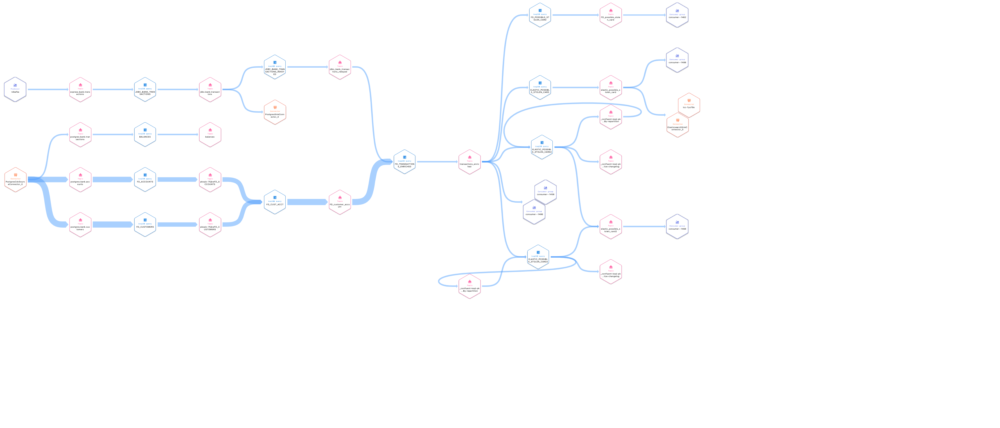
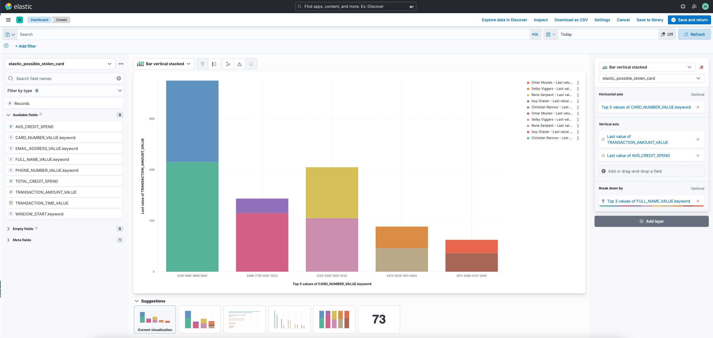

<div align="center" padding=25px>
    
</div>

# <div align="center">Application Modernization with Confluent Cloud</div>

## <div align="center">Workshop & Lab Guide</div>

# Introduction

In this demo, you'll walk through the stages describe in the [Strangler Fig Pattern](https://developer.confluent.io/patterns/compositional-patterns/strangler-fig) for incrementally breaking a monolithic application down into microservices. The intention of this demo is to express the stages involved in this process by providing components that come prebuilt and ready to deploy. All that's left is for you to deploy them in the order described in this guide and view the results.

---

## Requirements

In order to successfully complete this demo you need to install few tools before getting started.

- This demo was created using `minikube`. So that will be a necessity to have. On Mac, assuming you have `homebrew` (if not, get it), you can install it using the command `brew install minikube`.
- The development and testing for this demo was done on a `minikube` VM with approximately **4 CPUs**, **4GB of memory**, and **10GB of disk**. If that's more than your machine has, you can play around with less with the `minikube` commands. For example.
  ```sh
  minikube start --cpus=4 --disk-size="10gb" --memory="4gb"
  ```
- For some of the commands, you'll want a prettier output. So, `jq` is useful to have and will be use in these examples. If you don't have it installed, you can install it with `brew install jq`.
- This demo assumes you have Confluent Cloud setup and available to use. If you don't, sign up for a free trial [here](https://www.confluent.io/confluent-cloud/tryfree).
- Install Confluent Cloud CLI by following the instructions [here](https://docs.confluent.io/confluent-cli/current/install.html)
- Install Terraform by following the instructions [here](https://learn.hashicorp.com/tutorials/terraform/install-cli).
- An AWS account with permissions to create resources. Sign up for an account [here](https://aws.amazon.com/account/).

> **Note:** This demo was built and validate on a Mac (x86).

---

## Prerequisites

### Confluent Cloud

> **Note**: Ensure each step is completed successfully before proceeding to the next one. You can use [Confluent Cloud UI](confluent.cloud) to verify the completion of each step.

1. Clone and enter this repo.

   ```bash
   git clone https://github.com/confluentinc/demo-application-modernization.git
   cd demo-application-modernization
   ```

1. Open a `Terminal` window and run the following commands to set up your Confluent Cloud infrastructure.

1. Log in to your cluster using the `confluent login` command using a Confluent Cloud user account.

   ```bash
   confluent login --save
   ```

1. Create a new Confluent Cloud environment.

   ```bash
   confluent environment create -o json Application-Modernization
   ```

1. Switch to the Confluent Cloud environment you just created.

   ```bash
   confluent environment use <ID>
   ```

1. Create a new Kafka cluster. Basic cluster is enough for this demo.

   ```bash
   confluent kafka cluster create -o json cluster1 --cloud "aws" --region "us-west-2" --type "basic"
   ```

1. Wait until the cluster is in `Running` state.
1. Switch to the cluster you just created by running the following command.

   ```bash
   confluent kafka cluster use <CLUSTER_ID>
   ```

1. Enable `Schema Registery` by running the following command.

   ```bash
   confluent schema-registry cluster enable --cloud aws --geo 'us'
   ```

1. Create API key pair for `Schema Registery` by running the following command.

   ```bash
   confluent api-key create -o json --resource <SCHEMA_REGISTRY_CLUSTER_ID> --description "API Keys for Application Modernization Schema Registry" | jq -c '.'
   ```

1. Create API key pair for `Kafka` cluster by running the following command.

   ```bash
   confluent api-key create -o json --resource <KAFKA_CLUSTER_ID> --description "API Keys for Application Modernization Kafka Clients" | jq -c '.'
   ```

1. To verify the correct API key pair is in use, run the following command. The results should match the API key that you just created in previous step.

   ```bash
   confluent api-key list --resource <KAFKA_CLUSTER_ID>
   ```

1. Create a ksqlDB cluster by running the following command.

   ```bash
   confluent ksql cluster create -o json ksqlDB_app1 --csu 1 --api-key <KAFKA_API_KEY> --api-secret <KAFKA_API_SECRET> --cluster <KAFKA_CLUSTER_ID>
   ```

1. Wait until the ksqlDB cluster's status is changed from `Provisioning` to `Running`.
1. Create an API key pair for the `ksqlDB` cluster.

   ```bash
   confluent api-key create -o json --resource <KSQLDB_CLUSTER_ID>
   ```

1. Create the necessary `Kafka` topics.

   ```bash
   confluent kafka topic create postgres.bank.transactions
   confluent kafka topic create postgres.bank.accounts
   confluent kafka topic create postgres.bank.customers
   confluent kafka topic create express.bank.transactions
   ```

### Build the cloud infrastructure

1. Navigate to the repo's `Terraform` directory.
   ```bash
   cd terraform
   ```
1. Initialize Terraform within the directory.
   ```bash
   terraform init
   ```
1. Create the Terraform plan.
   ```bash
   terraform plan
   ```
1. Apply the plan to create the infrastructure.
   ```bash
   terraform apply
   ```
1. The `terraform apply` command will print the public IP addresses of the host EC2 instances for your Postgres service. You'll need this later to configuring the source connector.

### Web server and web applications

To keep things simple, we will use `Kubernetes` to deploy both web servers and web applications needed throughout the migration. However, you can opt-out of using `Kubernetes` and run the web servers and web applications locally.

<details>
    <summary><b>Without using Kubernetes</b></summary>
    
1. If you want to opt-out of using `Kubernetes` update the following files.
1. Create `monolith/.env` file with following configurations
    ```bash
    PGUSER="postgres"
    PGHOST=<EC2_IP_FROM_TERRAFORM>
    PGPASSWORD="app-mod-c0nflu3nt!"
    PGDATABASE="postgres"
    PGPORT="5432"
    ```
1. Create `microservices/.env` file with following configurations
    ```bash
    BOOTSTRAP_SERVERS=<BOOTSTRAP_SERVERS>
    CLIENT_KEY="<KAFKA_API_KEY>"
    CLIENT_SECRET="<KAFKA_API_SECRET>"
    SASL_USERNAME="<KAFKA_API_KEY>"
    SASL_PASSWORD="<KAFKA_API_SECRET>"
    SASL_JAAS_CONFIG="org.apache.kafka.common.security.plain.PlainLoginModule required username='<KAFKA_API_KEY>' password='<KAFKA_API_SECRET>';"
    SCHEMA_REGISTRY_API_KEY="<SCHEMA_REGISTRY_API_KEY>"
    SCHEMA_REGISTRY_API_SECRET="<SCHEMA_REGISTRY_API_SECRET>"
    SCHEMA_REGISTRY_BASIC_AUTH_USER_INFO="<SCHEMA_REGISTRY_API_KEY>:<SCHEMA_REGISTRY_API_SECRET>"
    SCHEMA_REGISTRY_URL=<SCHEMA_REGISTRY_URL>
    KSQLDB_API_KEY="<KSQLDB_API_KEY>"
    KSQLDB_API_SECRET="<KSQLDB_API_SECRET>"
    KSQLDB_APP_ENDPOINT=<KSQLDB_APP_ENDPOINT>
    ```
    > **Note**: Be prepared to do some error handling. You might have to delete package-lock.json files and re-install node modules. 
</details>

1. If you decide to use `Kubernetes` and `minikube` isn't already running, start it.
   ```bash
   minikube start
   ```
1. Run the following command to create `Kubernetes` secrets.
   ```bash
    kubectl create secret generic kafka-secrets \
    --from-literal=BOOTSTRAP_SERVERS="<BOOTSTRAP_SERVERS>" \
    --from-literal=CLIENT_KEY="<KAFKA_API_KEY>" \
    --from-literal=CLIENT_SECRET="<KAFKA_API_SECRET>" \
    --from-literal=SASL_JAAS_CONFIG="org.apache.kafka.common.security.plain.PlainLoginModule required username='<KAFKA_API_KEY>' password='<KAFKA_API_SECRET>'" \
    --from-literal=SCHEMA_REGISTRY_API_KEY="<SCHEMA_REGISTRY_API_KEY>" \
    --from-literal=SCHEMA_REGISTRY_API_SECRET="<SCHEMA_REGISTRY_API_SECRET>" \
    --from-literal=SCHEMA_REGISTRY_BASIC_AUTH_USER_INFO="<SCHEMA_REGISTRY_API_KEY>:<SCHEMA_REGISTRY_API_SECRET>" \
    --from-literal=SCHEMA_REGISTRY_URL="<SCHEMA_REGISTRY_URL>" \
    --from-literal=KSQLDB_API_KEY="<KSQLDB_API_KEY>" \
    --from-literal=KSQLDB_API_SECRET="<KSQLDB_API_SECRET>" \
    --from-literal=KSQLDB_APP_ENDPOINT="<KSQLDB_APP_ENDPOINT>"
   ```
1. Update `k8s/monolith-deployment.yaml` to include the correct IP address for EC2 that hosts your Postgres database.
   ```bash
   name: PGHOST
   value: "<EC2_IP_FROM_TERRAFORM>"
   ```

## Running the demo

The following steps will bring you through the process of "Modernizing" the provided application using Confluent Cloud and `Kafka`. Use the following simple diagram to capture the basic flow (not everything is depicted).

<div align="center">
    
</div>

### Deploy the "monolith"

1. Navigate to repo's directory.
   ```bash
   cd demo-application-modernization
   ```
1. If you haven't already, start `minikube`. If it's already started, you can skip this step.
   ```bash
   # minikube start can take arguments for how much of the host resources you want to dedicate to it as described earlier
   minikube start
   ```
1. Deploy the "monolith".
   - Create the "monolith" deployment.
     ```bash
     kubectl create -f k8s/monolith-deployment.yaml
     ```
   - Create the "monolith" service.
     ```bash
     kubectl create -f k8s/monolith-service.yaml
     ```
     > **Note**: If you aren't using `Kubernetes` open a new `Terminal` window and run `npx nodemon monolith.js`.
1. Next, deploy the web application.

   - Create the web application deployment.
     ```bash
     kubectl create -f k8s/webapp-deployment-mf1.yaml
     ```
   - Create the web application service.
     ```bash
     kubectl create -f k8s/webapp-service.yaml
     ```
     > **Note**: If you aren't using `Kubernetes` open a new `Terminal` window and navigate to `webapp-mf1` and run `npm start`. Then open a new web browser and go to http://localhost:3000.

1. Now, since `minikube` has deployed Kubernetes on a VM on your machine, you'll need to create a tunnel to make the services accessible on your machine. This command will start running in the foreground, so you may want to leave it on a terminal tab so you can stop the tunnel later.
   ```bash
   minikube tunnel
   ```

Now that you have deployed all the components for your "monolith", you can go to http://localhost:80/ in order to access the web application. Try creating a new transaction or querying for the current balance (after you've created a new transaction ideally).

### Deploy the CDC Connector

1. Update the `connectors/postgres_source.json` file to include the correct credentials.
1. Launch a Postgres source connector to connect your database with Confluent Cloud.
   ```bash
   confluent connect create --config connectors/postgres_source.json
   ```
   > **Note**: You can deploy this connector through Confluent Cloud web UI as well.
1. Wait until Postgres connector is in `Running` state.
1. Verify `postgres.bank.accounts` and `postgres.bank.customers` topics are populated either through `CLI` or Confluent Cloud web UI.

### Insert transactions

1. Navigate to http://localhost:80/ and insert the following transactions
   - card number: 5208-0272-3184-5035 amount: 5
   - card number: 5188-6083-8011-0307 amount: 100
   - card number: 5188-6083-8011-0307 amount: 250
   - card number: 5188-6083-8011-0307 amount: 400
   - card number: 5588-6461-5550-9705 amount: 120

### Create ksqlDB queries

The "microservice" in this demo will consume messages from `Kafka` by querying a `ksqlDB` table. In order to do that, you'll need to create them first.

1. Navigate to Confluent Cloud web UI and then go to ksqlDB cluster.
1. Change `auto.offset.reset = earliest`.
1. Use the editor to execute the following queries.
1. Create a new stream by reading the messages from the topic `postgres.bank.transactions`.
   ```sql
   CREATE STREAM postgres_bank_transactions WITH (KAFKA_TOPIC='postgres.bank.transactions', KEY_FORMAT ='JSON', VALUE_FORMAT='AVRO');
   ```
1. Verify `postgres_bank_transactions` stream is populated correctly and then hit **Stop**.
   ```sql
   SELECT * FROM postgres_bank_transactions EMIT CHANGES;
   ```
1. Create a new table for the balances of each card by reading from `postgres_bank_transactions` stream you just created.
   ```sql
   CREATE TABLE balances WITH (kafka_topic='balances') AS
       SELECT card_number, SUM(transaction_amount) AS balance
       FROM postgres_bank_transactions
       GROUP BY card_number
   EMIT CHANGES;
   ```
1. Verify the `balances` table is populated correctly.
   ```sql
   SELECT * FROM balances;
   ```

### Deploy the "microservice"

1. Back on the `Terminal`, use `kubectl` to create and deploy the "microservice".

   - Create the "microservice" deployment.
     ```bash
     kubectl create -f k8s/microservice-deployment.yaml
     ```
   - Create the "microservice" service.
     ```bash
     kubectl create -f k8s/microservice-service.yaml
     ```

   > **Note**: If you aren't using `Kubernetes` open a new `Terminal` window and run `npx nodemon microservices.js`.

1. Begin the cut-over from the "monolith" to the "microservice".
   - Delete the web application deployment for "mf1".
     ```bash
     kubectl delete -f k8s/webapp-deployment-mf1.yaml
     ```
   - Create the web application deployment for "mf2".
     ```bash
     kubectl create -f k8s/webapp-deployment-mf2.yaml
     ```
     There's probably a better way to do this, but I'm no Kubernetes administrator 😇 .
     > **Note**: If you aren't using `Kubernetes` open a new `Terminal` window and navigate to `webapp-mf1` directory and run `npm stop`. Then go to `webapp-mf2` directory and run `npm start`. The web browser should automatically refresh with the updated version of the frontend application.

Now that the new version of the web application has been deployed. Head back to the web browser and test out creating new transactions and getting balances. If everything went as expected, the user interaction in the front end shouldn't have changed.

### Add ksqlDB format conversion

Since the data from our nodejs "microservice" won't have a schema (the `node-rdkafka` library doesn't currently have a support for this, but there are some out there), you'll want to convert the messages that will be produced to `Kafka` from the "microservice" to a new topic where the messages will have a given schema. This is pretty simple to do with `ksqlDB`.

1. Create a new stream for the transactions received from the "microservice".

   ```sql
   CREATE STREAM express_bank_transactions (
    `key` VARCHAR KEY,
    `transaction_id` VARCHAR,
    `card_number` VARCHAR,
    `transaction_amount` INTEGER,
    `transaction_time` VARCHAR)
    WITH (kafka_topic='express.bank.transactions', value_format='JSON');
   ```

1. Verify the `express_bank_transactions` stream is populated correctly and then hit **Stop**.
   ```sql
   SELECT * FROM express_bank_transactions EMIT CHANGES;
   ```
1. Create another stream by reading from `express_bank_transactions` and specifying the output stream's value format.
   ```sql
   CREATE STREAM jdbc_bank_transactions WITH (KAFKA_TOPIC='jdbc.bank.transactions', PARTITIONS=6, REPLICAS=3, VALUE_FORMAT='AVRO') AS
      SELECT `key`, `transaction_id`,`card_number`, `transaction_amount`, `transaction_time`
      FROM express_bank_transactions
   EMIT CHANGES;
   ```
1. Verify the `jdbc_bank_transactions` stream is populated correctly and then hit **Stop**.
   ```sql
   SELECT * FROM jdbc_bank_transactions EMIT CHANGES;
   ```

The second query will create an output topic named `jdbc.bank.transactions` which we can use to sink the data back to Postgres with another connector.

### Deploy Postgres Sink Connector

Similarly to how you deployed the Debezium Postgres CDC Source Connector earlier, you'll now deploy a Postgres Sink Connector. This will write events from topics back to Postgres for consistency in our pipeline.

1. Update the `connectors/postgres_sink.json` file to include the correct credentials.
1. Launch a Postgres sink connector.
   ```bash
   confluent connect create --config connectors/postgres_sink.json
   ```
   > **Note**: You can deploy this connector through Confluent Cloud web UI as well.
1. Wait until Postgres Sink connector is in `Running` state.

### Complete the "cut over" from the "monolith" to the "microservice"

In this final step you'll deploy the third version of the web application which will direct both **reads** and **writes** of data to the "microservice".

1. Complete the cut over.

   - Delete the web application deployment for "mf2".
     ```bash
     kubectl delete -f k8s/webapp-deployment-mf2.yaml
     ```
   - Create the web application deployment for "mf3".
     ```bash
     kubectl create -f k8s/webapp-deployment-mf3.yaml
     ```

   > **Note**: If you aren't using `Kubernetes` open a new `Terminal` window and navigate to `webapp-mf2` directory and run `npm stop`. Then go to `webapp-mf3` directory and run `npm start`. The web browser should automatically refresh with the updated version of the front end application.

1. (Optional for extra effect) Delete the "monolith".

   - Delete the "monolith" deployment.
     ```bash
     kubectl delete -f k8s/monolith-deployment.yaml
     ```
   - Delete the "monolith" service.
     ```bash
     kubectl delete -f k8s/monolith-service.yaml
     ```

   > **Note**: If you aren't using `Kubernetes` navigate to `monolith` directory and run stop the service.

## End of Application Modernization

If you followed the steps closely, and everything went as planned, you will have migrated a simple module of a "monolith" into its own "microservice" using the Stangler Fig pattern.
In the real world this process is much more tedious and there are more considerations to take into account, but the basic principles should be consistent.

## Building new use cases with Confluent Cloud and ksqlDB

Now that you have set your data in motion with Confluent Cloud, you can build real-time applications which would have been impossible before. For example, in order to be able to detect an unusual activity on a customer's credit card we need to have real-time access to transactions and each customer's spending habits. Let's leverage the Detect Unusual Credit Card Activity [recipe](https://developer.confluent.io/tutorials/credit-card-activity/confluent.html) to build this capability with Confluent Cloud and `ksqlDB`.

1. Create customer stream from `postgres.bank.customers`.

   ```sql
   CREATE STREAM fd_cust_raw_stream WITH (KAFKA_TOPIC = 'postgres.bank.customers',VALUE_FORMAT = 'AVRO', KEY_FORMAT ='JSON');
   ```

1. Verify the `fd_cust_raw_stream` stream is populated correctly and then hit **Stop**.

   ```sql
   SELECT * FROM fd_cust_raw_stream EMIT CHANGES;
   ```

1. Create customer table from `fd_cust_raw_stream` which will hold the latest information for each customer.
   ```sql
   CREATE TABLE fd_customers WITH (FORMAT='AVRO') AS
    SELECT customer_id AS customer_id,
        LATEST_BY_OFFSET(first_name) AS first_name,
        LATEST_BY_OFFSET(last_name) AS last_name,
        LATEST_BY_OFFSET(phone_number) AS phone_number,
        LATEST_BY_OFFSET(email_address) AS email_address
    FROM fd_cust_raw_stream
    GROUP BY customer_id;
   ```
1. Verify the `fd_customers` table is populated correctly.
   ```sql
   SELECT * FROM fd_customers;
   ```
1. Create account stream from `postgres.bank.accounts`.
   ```sql
   CREATE STREAM fd_acct_raw_stream WITH (KAFKA_TOPIC = 'postgres.bank.accounts',VALUE_FORMAT = 'AVRO', KEY_FORMAT ='JSON');
   ```
1. Verify the `fd_acct_raw_stream` stream is populated correctly and then hit **Stop**.
   ```sql
   SELECT * FROM fd_acct_raw_stream EMIT CHANGES;
   ```
1. Create account table from `fd_acct_raw_stream` which will hold the latest information for each account.
   ```sql
   CREATE TABLE fd_accounts WITH (FORMAT='AVRO') AS
    SELECT card_number AS card_number,
        LATEST_BY_OFFSET(account_id) AS account_id,
        LATEST_BY_OFFSET(customer_id) AS customer_id,
        LATEST_BY_OFFSET(avg_spend) AS avg_spend
    FROM fd_acct_raw_stream
    GROUP BY card_number;
   ```
1. Verify the `fd_accounts` table is populated correctly.
   ```sql
   SELECT * FROM fd_accounts;
   ```
1. Now, we need to join `fd_accounts` and `fd_customers` tables so we know what is the average spent for each customer.
   ```sql
   CREATE TABLE fd_cust_acct WITH (KAFKA_TOPIC = 'FD_customer_account', KEY_FORMAT='JSON',VALUE_FORMAT='AVRO') AS
   SELECT
      C.CUSTOMER_ID AS CUSTOMER_ID,
      C.FIRST_NAME + ' ' + C.LAST_NAME AS FULL_NAME,
      C.PHONE_NUMBER,
      C.EMAIL_ADDRESS,
      A.ACCOUNT_ID,
      A.CARD_NUMBER,
      A.AVG_SPEND
   FROM fd_accounts A
   INNER JOIN fd_customers C
   ON A.CUSTOMER_ID = C.CUSTOMER_ID;
   ```
1. Verify the `fd_cust_acct` table is populated correctly.
   ```sql
    SELECT * FROM fd_cust_acct;
   ```
1. We need to rekey the `jdbc_bank_transactions` so the `card_number` is the primary key.
   ```sql
   CREATE STREAM jdbc_bank_transactions_rekeyed
   WITH (KAFKA_TOPIC='jdbc_bank_transactions_rekeyed',PARTITIONS=6, REPLICAS=3, VALUE_FORMAT='AVRO') AS
      SELECT `card_number` as card_number, `transaction_id` as transaction_id, `transaction_amount` as transaction_amount, `transaction_time` as transaction_time
      FROM jdbc_bank_transactions
      PARTITION BY `card_number`
   EMIT CHANGES;
   ```
1. Verify the `jdbc_bank_transactions_rekeyed` stream is populated correctly and then hit **Stop**.
   ```sql
    SELECT * FROM jdbc_bank_transactions_rekeyed EMIT CHANGES;
   ```
1. Now, we can join each transaction that is posted with customer's information and enrich our data.

   ```sql
   CREATE STREAM fd_transactions_enriched WITH (KAFKA_TOPIC = 'transactions_enriched' , KEY_FORMAT = 'JSON', VALUE_FORMAT='AVRO') AS
    SELECT
        T.CARD_NUMBER AS CARD_NUMBER,
        T.TRANSACTION_ID,
        T.TRANSACTION_AMOUNT,
        T.TRANSACTION_TIME,
        C.FULL_NAME,
        C.PHONE_NUMBER,
        C.EMAIL_ADDRESS,
        C.AVG_SPEND
    FROM jdbc_bank_transactions_rekeyed T
    INNER JOIN fd_cust_acct C
    ON C.CARD_NUMBER = T.CARD_NUMBER;
   ```

1. Finally, we can aggregate the stream of transactions for each account ID using a two-hour tumbling window, and filter for accounts in which the total spend in a two-hour period is greater than the customer’s average:
   ```sql
   CREATE TABLE fd_possible_stolen_card WITH (KAFKA_TOPIC = 'FD_possible_stolen_card', KEY_FORMAT = 'JSON', VALUE_FORMAT='JSON') AS
   SELECT
      TIMESTAMPTOSTRING(WINDOWSTART, 'yyyy-MM-dd HH:mm:ss') AS WINDOW_START,
      T.TRANSACTION_TIME,
      T.CARD_NUMBER,
      T.TRANSACTION_AMOUNT,
      T.FULL_NAME,
      T.EMAIL_ADDRESS,
      T.PHONE_NUMBER,
      SUM(T.TRANSACTION_AMOUNT) AS TOTAL_CREDIT_SPEND,
      MAX(T.AVG_SPEND) AS AVG_CREDIT_SPEND
   FROM fd_transactions_enriched T
   WINDOW TUMBLING (SIZE 2 HOURS)
   GROUP BY T.CARD_NUMBER, T.TRANSACTION_AMOUNT, T.FULL_NAME, T.EMAIL_ADDRESS, T.PHONE_NUMBER, T.TRANSACTION_TIME
   HAVING SUM(T.TRANSACTION_AMOUNT) > MAX(T.AVG_SPEND);
   ```
1. Navigate to the Online Banking application (http://localhost:80/) and insert more transactions

   - card number: 5208-0272-3184-5035 amount: 20
   - card number: 5188-6083-8011-0307 amount: 39
   - card number: 5188-6083-8011-0307 amount: 561
   - card number: 5588-6461-5550-9705 amount: 78
   - card number: 5588-6461-5550-9705 amount: 142

1. Navigate back to the ksqlDB editor in Confluent Cloud and see which activies have been flaged.
   ```sql
    SELECT * FROM fd_possible_stolen_card;
   ```
1. In this example the following activies have been flagged

   - card number: 5208-0272-3184-5035 amount: 20
   - card number: 5588-6461-5550-9705 amount: 142
   - card number: 5188-6083-8011-0307 amount: 561
     > **Note**: You can run `SELECT * FROM fd_cust_acct;` and review the `avg_spend` field for each `card_number` to better understand which activities are being flagged.

1. The `fd_possible_stolen_card` is automatically updated to include a new suspicious acitivity. Which means there is no need for running a batch job to get the latest data. You can use the underlying Kafka topic as a source for downstream systems. For example, you can send this data to a a database such as MongoDB so these acitivies can be stored for auditing purposes. You can also stream this data to an Elasticsearch cluster and build a real-time dashboard. We will send the data to Elasticsearch.
1. The `fd_possible_stolen_card` has a composite key that includes `CARD_NUMBER`, `TRANSACTION_AMOUNT`, `FULL_NAME`, `EMAIL_ADDRESS`, `PHONE_NUMBER` and `TRANSACTION_TIME`. If we were to send this table to Elasticsearch these fields will be used as the `_id` field which is not aggregatable. Hence, we need to create a new table and add these fields as values too.
1. Create a new table called `elastic_possible_stolen_card`.
   ```sql
   CREATE TABLE elastic_possible_stolen_card WITH (KAFKA_TOPIC = 'elastic_possible_stolen_card', KEY_FORMAT = 'JSON', VALUE_FORMAT='JSON') AS
    SELECT
        TIMESTAMPTOSTRING(WINDOWSTART, 'yyyy-MM-dd HH:mm:ss') AS WINDOW_START,
        T.TRANSACTION_TIME,
        T.CARD_NUMBER,
        T.TRANSACTION_AMOUNT,
        T.FULL_NAME,
        T.EMAIL_ADDRESS,
        T.PHONE_NUMBER,
        AS_VALUE(T.TRANSACTION_TIME) AS TRANSACTION_TIME_VALUE,
        AS_VALUE(T.CARD_NUMBER) AS CARD_NUMBER_VALUE,
        AS_VALUE(T.TRANSACTION_AMOUNT) AS TRANSACTION_AMOUNT_VALUE,
        AS_VALUE(T.FULL_NAME) AS FULL_NAME_VALUE,
        AS_VALUE(T.EMAIL_ADDRESS) AS EMAIL_ADDRESS_VALUE,
        AS_VALUE(T.PHONE_NUMBER) AS PHONE_NUMBER_VALUE,
        SUM(T.TRANSACTION_AMOUNT) AS TOTAL_CREDIT_SPEND,
        MAX(T.AVG_SPEND) AS AVG_CREDIT_SPEND
    FROM fd_transactions_enriched T
    WINDOW TUMBLING (SIZE 2 HOURS)
    GROUP BY T.CARD_NUMBER, T.TRANSACTION_AMOUNT, T.FULL_NAME, T.EMAIL_ADDRESS, T.PHONE_NUMBER, T.TRANSACTION_TIME
    HAVING SUM(T.TRANSACTION_AMOUNT) > MAX(T.AVG_SPEND);
   ```
1. Verify the `elastic_possible_stolen_card` table is populated correctly.
   ```sql
    SELECT * FROM elastic_possible_stolen_card;
   ```

### Confluent Cloud Stream Lineage

Confluent gives you tools such as Stream Quality, Stream Catalog, and Stream Lineage to ensure your data is high quality, observable and discoverable. Learn more about the **Stream Governance** [here](https://www.confluent.io/product/stream-governance/) and refer to the [docs](https://docs.confluent.io/cloud/current/stream-governance/overview.html) page for detailed information.

1. Navigate to https://confluent.cloud
1. Use the left hand-side menu and click on **Stream Lineage**.
   Stream lineage provides a graphical UI of the end to end flow of your data. Both from the a bird’s eye view and drill-down magnification for answering questions like:
   - Where did data come from?
   - Where is it going?
   - Where, when, and how was it transformed?
   In the bird's eye view you see how one stream feeds into another one. As your pipeline grows and becomes more complex, you can use Stream lineage to debug and see where things go wrong and break.
   <div align="center">
      
   </div>

### Build a real-time dashboard

1. Create a free account on [Elastic](https://www.elastic.co/).
1. Deploy a cluster in the same region as your Confluent Cloud. We used AWS-West-2 in this demo.
1. Download the API key pair.
1. Wait until the cluster is up and running.
1. Update the `connectors/elastic_sink.json` file to include the correct credentials.
1. Launch a Elasticsearch sink connector.
   ```bash
   confluent connect create --config connectors/elastic_sink.json
   ```
   > **Note**: You can deploy this connector through Confluent Cloud web UI as well.
1. Wait until Elasticsearch connector is in `Running` state.
1. Navigate to the Elastic website and verify `elastic_possible_stolen_card` exist.
1. Below is an example of a dashboard that you can build.
<div align="center">
    
</div>
